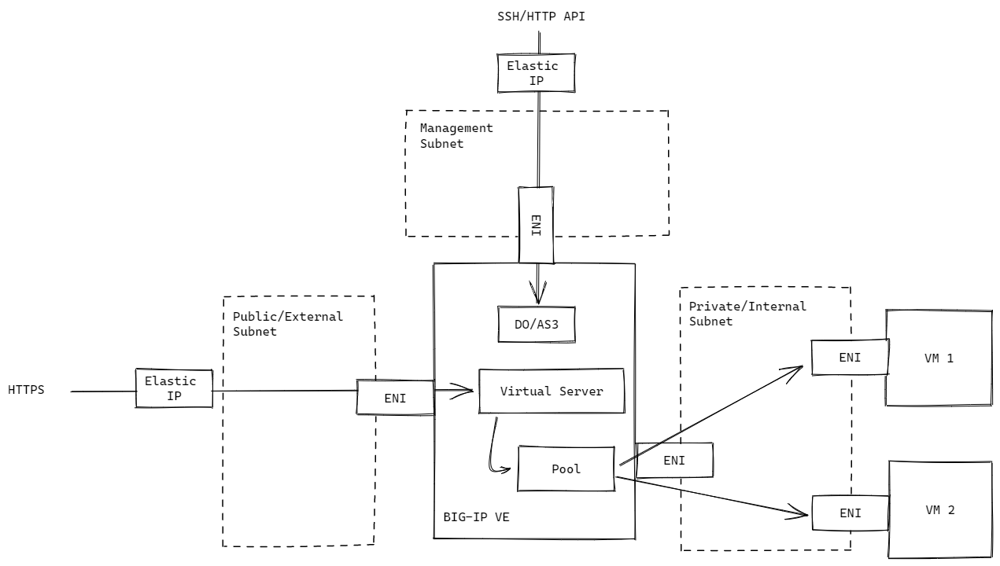

# BIG-IP AWS IaC Demo

This repository showcase how BIG-IP VE can be managed as Infrastructure as Code (IaC) on AWS via two separate Terraform projects:
1. [Deployment](./deployment/) which deploys the AWS resources, including a BIG-IP VE and two VMs running [f5-demo-httpd](https://github.com/f5devcentral/f5-demo-httpd).
1. [Configuration](./configuration/) which:
    - configures the BIG-IP interfaces and modules via [Declarative Onboarding](https://clouddocs.f5.com/products/extensions/f5-declarative-onboarding/latest/), and
    - configures a virtual server with the VMs as pool members via [Application Services 3](https://clouddocs.f5.com/products/extensions/f5-appsvcs-extension/latest/)

Diagram below depicts the high level network design:


---

## Setup

Using [deployment/variables.tf](./deployment/variables.tf) as reference, create a Terraform variables file `deployment/terraform.tfvars`. Then, deploy and configure the BIG-IP and pool members by running
```
terraform -chdir=deployment apply -auto-approve
terraform -chdir=configuration apply -auto-approve
```

## Testing

Test the deployment by sending a request to the BIG-IP virtual server
```
VS_URL=$(terraform -chdir=deployment output -raw bigip_external_url)
curl -sk $VS_URL/txt
```

You should see responses from multiple pool members (see `Short Name` in response) due to load balancing.

## Clean up

```
terraform -chdir=configuration destroy -auto-approve
terraform -chdir=deployment destroy -auto-approve
```
