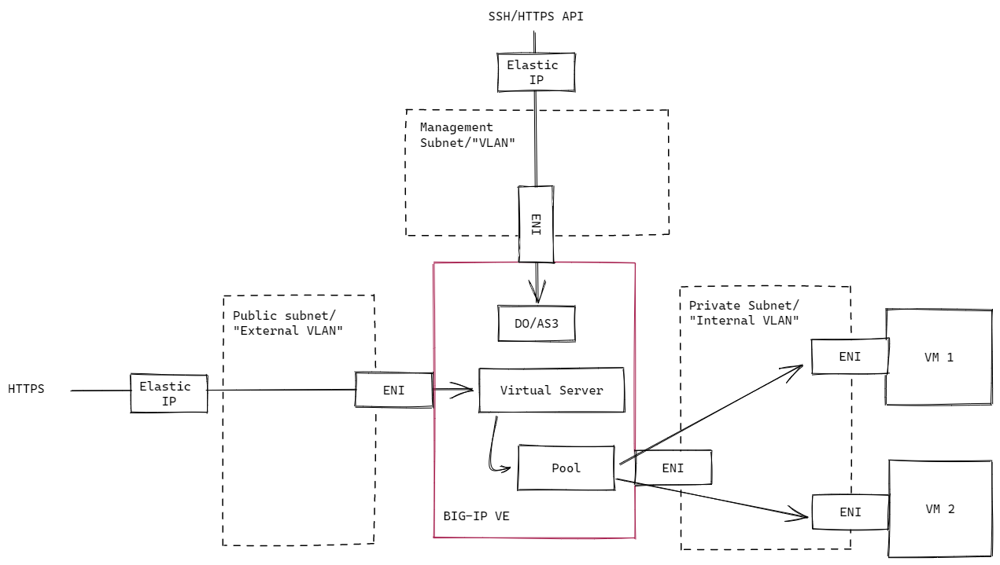

# BIG-IP AWS IaC Demo

This repository showcases how BIG-IP VE can be managed as Infrastructure as Code (IaC) on AWS via two separate Terraform projects:
1. [Deployment](./deployment/) which deploys the AWS resources, including a BIG-IP VE and two VMs running [f5-demo-httpd](https://github.com/f5devcentral/f5-demo-httpd).
1. [Configuration](./configuration/) which:
    - configures the BIG-IP interfaces and modules via [Declarative Onboarding (DO)](https://clouddocs.f5.com/products/extensions/f5-declarative-onboarding/latest/), and
    - configures an HTTPS virtual server with the VMs as pool members via [Application Services 3 (AS3)](https://clouddocs.f5.com/products/extensions/f5-appsvcs-extension/latest/)

Diagram below depicts the high level network design:


---

## Deployment

1. In the [deployment/](deployment/) directory, create a `terraform.tfvars` file containing values for variables defined in [deployment/variables.tf](./deployment/variables.tf).
1. Deploy the BIG-IP and pool members by running
    ```
    terraform -chdir=deployment init
    terraform -chdir=deployment apply -auto-approve
    ```

At this point, you can [access the BIG-IP over SSH or the TMUI](#accessing-big-ip).

## Configuration

> The deployment Terraform project above automatically creates a separate `terraform.tfvars` file in the [configuration/](configuration/) directory, which will be used in this section.

1. Configure the BIG-IP with DO and AS3 to expose the backend applications by running
    ```
    terraform -chdir=configuration init
    terraform -chdir=configuration apply -auto-approve
    ```
1. Once completed, test the deployment by sending a request from your host machine to the BIG-IP virtual server
    ```
    VS_URL=$(terraform -chdir=deployment output -raw bigip_external_url)
    curl -sk $VS_URL/txt
    ```
    You should see responses from multiple pool members (see `Short Name` in response) due to load balancing.

___

## Accessing BIG-IP

> 🛡️ By default, AWS Security Groups are configured with rules to only allow the IP address of the host that executed the `terraform apply` commands to access the EC2 instances. This can be overridden by providing different network/IP addresses to the `allowed_ips` variable.

To access the BIG-IP TMUI or SSH to it, retrieve the BIG-IP FQDN and credentials by running
```bash
# BIG-IP management FQDN/URL
terraform -chdir=deployment output -raw bigip_mgmt_url

# BIG-IP username
terraform -chdir=deployment output -raw bigip_username

# BIG-IP password
terraform -chdir=deployment output -raw bigip_password
```

## Clean up

```
terraform -chdir=configuration destroy -auto-approve
terraform -chdir=deployment destroy -auto-approve
```
